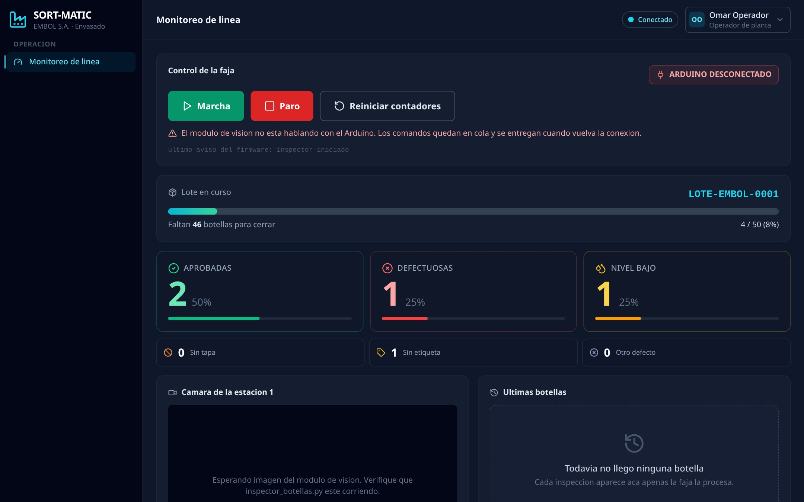

# SORT-MATIC · Manual de Usuario Digital

Sitio estático desplegable en GitHub Pages o Netlify.

## 📁 Estructura de archivos

```
docs/
├── index.html          ← Página principal del manual
├── assets/
│   ├── style.css       ← Estilos dark mode (cyan + purple)
│   ├── app.js          ← Navegación SPA, buscador Ctrl+K
│   └── img/            ← CAPTURAS DE PANTALLA (ver abajo)
└── README.md           ← Este archivo
```

## 🚀 Levantar localmente

```bash
# Opción A: Python (sin instalación)
cd docs/
python3 -m http.server 8080

# Opción B: Node.js serve
npx serve docs/

# Opción C: VS Code
# Instale "Live Server" → clic derecho en index.html → "Open with Live Server"
```

Luego abra: **http://localhost:8080**

---

## 📸 Placeholders de imágenes

El manual tiene **15 placeholders** donde debe insertar capturas de pantalla reales.
Cada placeholder indica la ruta exacta del archivo de imagen esperado.

| Placeholder ID | Archivo esperado | Descripción |
|---|---|---|
| `ph-intro-panorama`    | `assets/img/intro-panorama.jpg` | Vista general del sistema |
| `ph-roles-tabla`       | `assets/img/roles-login.jpg` | Pantalla de login con los 3 roles |
| `ph-login`             | `assets/img/login-screen.jpg` | Formulario de inicio de sesión |
| `ph-scada-dashboard`   | `assets/img/scada-dashboard.jpg` | Dashboard SCADA completo |
| `ph-scada-control`     | `assets/img/scada-control-panel.jpg` | Panel Marcha/Paro/Reset |
| `ph-camera-live`       | `assets/img/camera-live.jpg` | Vista cámara con detecciones YOLO |
| `ph-contadores`        | `assets/img/contadores-linea.jpg` | Contadores en tiempo real |
| `ph-eventos-feed`      | `assets/img/eventos-feed.jpg` | Feed de eventos |
| `ph-analiticos-dashboard` | `assets/img/analiticos-dashboard.jpg` | Pantalla Analíticos completa |
| `ph-kpi-grid`          | `assets/img/kpi-grid.jpg` | KPI Grid con 5 indicadores |
| `ph-pareto`            | `assets/img/pareto-defectos.jpg` | Gráfico de Pareto |
| `ph-trend-chart`       | `assets/img/trend-chart.jpg` | Gráfico de tendencia |
| `ph-lotes`             | `assets/img/lotes-screen.jpg` | Pantalla de lotes |
| `ph-mermas-gallery`    | `assets/img/mermas-gallery.jpg` | Galería de mermas |
| `ph-merma-modal`       | `assets/img/merma-modal-detalle.jpg` | Modal detalle merma |
| `ph-mermas-filtros`    | `assets/img/mermas-filtros.jpg` | Filtros de mermas |
| `ph-exportar`          | `assets/img/exportar-lotes.jpg` | Botón exportar CSV |
| `ph-parametros-screen` | `assets/img/parametros-screen.jpg` | Pantalla de parámetros |
| `ph-sliders`           | `assets/img/parametros-sliders.jpg` | Deslizadores de confianza |
| `ph-save-bar`          | `assets/img/parametros-save-bar.jpg` | Barra "Aplicar a la línea" |
| `ph-usuarios`          | `assets/img/usuarios-screen.jpg` | Pantalla de usuarios |
| `ph-auditoria`         | `assets/img/auditoria-screen.jpg` | Bitácora de auditoría |

### Cómo reemplazar un placeholder

1. Guarde la captura en `docs/assets/img/` con el nombre indicado.
2. En `index.html`, busque el `div` con el `id` del placeholder (ej: `ph-scada-dashboard`).
3. Reemplace **todo el bloque** `<div class="img-placeholder ...">...</div>` por:

```html
<figure class="manual-figure">
  
  <figcaption>Dashboard de Monitoreo de Línea (Operador)</figcaption>
</figure>
```

4. Añada estos estilos al CSS si usa `<figure>`:
```css
.manual-figure { margin: 0; border-radius: 0.875rem; overflow: hidden; border: 1px solid var(--border); }
.manual-figure img { width: 100%; display: block; }
.manual-figure figcaption { padding: 0.5rem 1rem; font-size: 0.8rem; color: var(--text-dim); background: var(--bg-800); }
```

---

## 🌐 Desplegar en GitHub Pages

1. En el repositorio de GitHub, vaya a **Settings → Pages**.
2. En "Source", seleccione la rama `main` y la carpeta `/docs`.
3. Haga clic en **Save**.
4. En ~1 minuto el manual estará disponible en:
   `https://<usuario>.github.io/<repositorio>/`

---

## 🌐 Desplegar en Netlify

### Opción A: Drag & Drop
1. Vaya a [app.netlify.com](https://app.netlify.com) → "Sites".
2. Arrastre la carpeta `docs/` al área de drop.
3. Listo — obtendrá una URL pública inmediata.

### Opción B: Conectar repositorio
1. En Netlify, haga clic en "Add new site → Import an existing project".
2. Conecte su repositorio de GitHub.
3. Configure:
   - **Base directory:** `docs`
   - **Publish directory:** `docs`
   - **Build command:** (vacío)
4. Haga clic en **Deploy**.

---

## ✨ Características del manual

- **Dark Mode** nativo — fondo slate-900/950, acentos cian + violeta.
- **Navegación SPA** — sin recargas de página, URL con hash para enlazar secciones.
- **Buscador** (`Ctrl+K`) — búsqueda instantánea entre todas las secciones.
- **Responsive** — sidebar colapsable en móvil y tablet.
- **Barra de progreso** — indicador de lectura en la parte superior.
- **Placeholders** claros con código HTML listo para copiar/pegar.
- **Sin dependencias** — solo HTML + CSS + JS vanilla. Sin Node.js, sin build.
